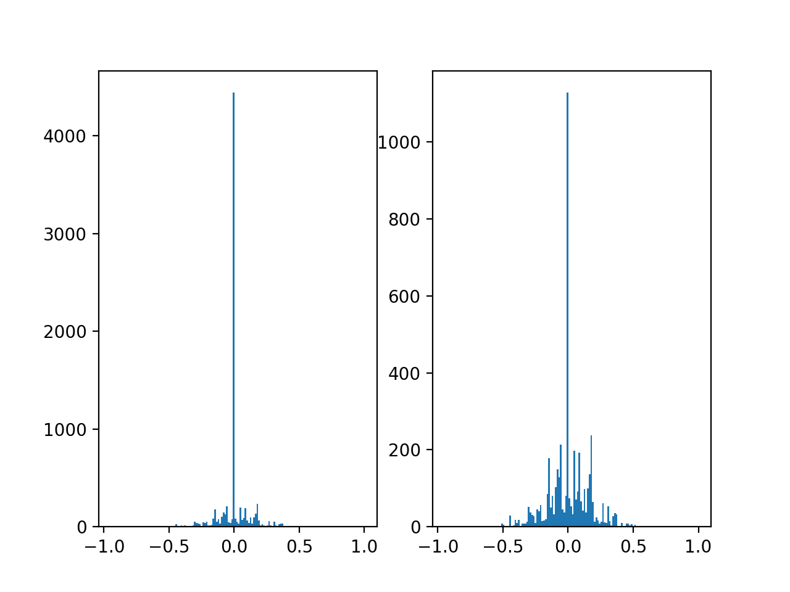

# Udacity Self-Driving Car Engineer Nanodegree - Behavioral Cloning Project

*My solution to the Udacity Self-Driving Car Engineer Nanodegree Behavioral Cloning project.*

**Note: This project makes use of a Udacity-developed driving simulator and training data collected from the simulator (neither of which is included in this repo).**

## Introduction

The object of this project is to apply deep learning principles to effectively teach a car to drive autonomously in a simulated driving application. The simulator includes both training and autonomous modes, and two tracks on which the car can be driven - I will refer to these as the "test track" (which is the track from which training data is collected and on which the output is evaluated for project credit) and the "challenge track" (which includes hills, tight turns, and other features not included in the test track).

In training mode, user generated driving data is collected in the form of simulated car dashboard camera images and control data (steering angle, throttle, brake, speed). Using the Keras deep learning framework, a convolutional neural network (CNN) model is produced using the collected driving data (see `model.py`) and saved as `model.json` (with CNN weights saved as `model.h5`).

Using the saved model, drive.py (provided by Udacity, but amended slightly to ensure compatibility with the CNN model and to fine tune controls) starts up a local server to control the simulator in autonomous mode. The command to run the server is `python drive.py model.json`; the model weights are retrieved using the same name but with the extension `.h5` (i.e. `model.h5`).

The challenge of this project is not only developing a CNN model that is able to drive the car around the test track without leaving the track boundary, but also feeding training data to the CNN in a way that allows the model to generalize well enough to drive in an environment it has not yet encountered (i.e. the challenge track).

## Approach

### 1. Base Model and Adjustments

The project instructions from Udacity suggest starting from a known self-driving car model and provided a link to the [nVidia model](https://images.nvidia.com/content/tegra/automotive/images/2016/solutions/pdf/end-to-end-dl-using-px.pdf) (and later in the student forum, the [comma.ai model](https://github.com/commaai/research/blob/master/train_steering_model.py)).  The table below is a depiction of my architecture that closely resembles the NVIDIA model.
The Adam optimizer was chosen with default parameters and the chosen loss function was mean squared error (MSE). The final layer  is a fully-connected layer with a single neuron.

| Input       | Filter Depth   | Filter Size  |Pad|Stride| No. Neurons|
| ------------- |:-------------:| -----:|:----:|:----:|:----:|
| Conv Layer 1     | 16 | 8x8|Same|4| | |
| Conv Layer 2     | 32|  5x5 |Same |2||
| Conv Layer 3| 64 |   5x5|Same|2| |
|Fully-connected 1| x|x|x|x| 512|
|fully-connected 2|x|x|x|x|50|
|fully-connected 3|x|x|x|x|10|
|Output|x|x|x|x|1|

### 2. Preprocessing

In training mode, the simulator produces three images per frame while recording corresponding to left-, right-, and center-mounted cameras, each giving a different perspective of the track ahead. The simulator also produces a `csv` file which includes file paths for each of these images, along with the associated steering angle, throttle, brake, and speed for each frame. My algorithm loads the file paths for all three camera views for each frame, along with the angle (adjusted by +0.25 for the left frame and -0.25 for the right), into two numpy arrays `image_paths` and `angles`. [*`model.py` lines 174-211*]

Images produced by the simulator in training mode are 320x160x3, and therefore require preprocessing prior to being fed to the CNN because it expects input images to be size 80x160. To achieve this,
* Crop the bottom 25 pixels and the top 70 pixels   from the image
* Resize to 80x160.
* Normalize the image

### 3. Data Distribution Flattening

Because the test track includes long sections with very slight or no curvature, the data captured from it tends to be heavily skewed toward low and zero turning angles. This creates a problem for the neural network, which then becomes biased toward driving in a straight line and can become easily confused by sharp turns. The distribution of the input data can be observed below, the black line represents what would be a uniform distribution of the data points.

To reduce the occurrence of low and zero angle data points, I first chose a number of bins (I decided upon 23) and produced a histogram of the turning angles using `numpy.histogram`. I also computed the average number of samples per bin (`avg_samples_per_bin` - what would be a uniform distribution) and plotted them together. Next, I determined a "keep probability" (`keep_prob`) for the samples belonging to each bin. That keep probability is 1.0 for bins that contain less than `avg_samples_per_bin`, and for other bins the keep probability is calculated to be the number of samples for that bin divided by `avg_samples_per_bin` (for example, if a bin contains twice the average number of data points its keep probability will be 0.5). Finally, I removed random data points from the data set with a frequency of `(1 - keep_prob)`.
The resulting data distribution can be seen in the chart below. The distribution is not uniform overall, but it is much closer to uniform for lower and zero turning angles.

* After implementing the above strategies, the resulting model performed very well - driving reliably around the test track multiple times. It also navigated the challenge track quite well, until it encountered an especially sharp turn. The following strategies were adopted primarily to improve the model enough to drive the length of the challenge track, although not all of the them contributed to that goal directly.*

### 4. Implementing a Python Generator in Keras

When working with datasets that have a large memory footprint (large quantities of image data, in particular) Keras python generators are a convenient way to load the dataset one batch at a time rather than loading it all at once.

The generator `generate_training_data` accepts as parameters a numpy array of strings `image_paths`, a numpy array of floats `angles`, an integer `batch_size` (default of 128), and a boolean `validation_flag` (default of `False`). Loading the numpy arrays `image_paths` (string) and `angles` (float) from the csv file, as well as adjusting the data distribution (see "Data Distribution Flattening," above) and splitting the data into training and test sets, is still done in the main program.

`generate_training_data` shuffles `image_paths` and `angles`, and for each pair it reads the image referred to by the path using `cv2.imread`. It then calls `preprocess_image` and `random_distort` (if `validation_flag` is `False`) to preprocess and jitter the image. If the magnitude of the steering angle is greater than 0.33, another image is produced which is the mirror image of the original using `cv2.flip` and the angle is inverted - this helps to reduce bias toward low and zero turning angles, as well as balance out the instance of higher angles in each direction so neither left nor right turning angles become overrepresented. Each of the produced images and corresponding angles is added to a list and when the lengths of the lists reach `batch_size` the lists are converted to numpy arrays and yielded to the calling generator from the model. Finally, the lists are reset to allow another batch to be built and `image_paths` and `angles` are again shuffled.

### 5. Methods used to avoid overfitting

Some other strategies implemented to combat overfitting and otherwise attempt to get the car to drive more smoothly are (these were implemented mostly due to consensus from the nanodegree community, and not necessarily all at once):

- Adding dropout layers
- Removing `tanh` activations on fully-connected layers and adding `ELU` activations to all model layers - convolutional and fully-connected
- Adjust learning rate of Adam optimizer to 0.0001 (rather than the default of 0.001)

These strategies did, indeed, result in less bouncing back and forth between the sides of the road, particularly on the test track where the model was most likely to overfit to the recovery data.

## Conclusion and Discussion

In future,  I would like to revisit my implementation  related to the distribution flattening scheme. As it is currently implemented, a very large chunk of data is thrown out, never to be seen again. I find this bothersome, and I feel that wasting data like this (even if it is mostly zero/near-zero steering angles) is a missed opportunity to train a model that can better generalize. In the future, I would like to pass the full dataset (`image_paths` and `angles`) to the generator and allow it to flatten the distribution itself, throwing out a different portion of the data each epoch or batch.

I would also like to revisit implementing a  neural net with a few hundred parameters.  Such a small neural net is desirable because it greatly reduces training time and can produce near real-time predictions, which is very important for a real-world self-driving car application.
